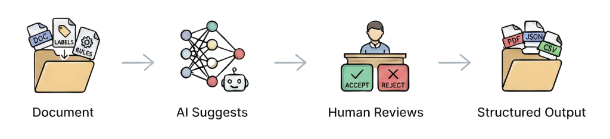
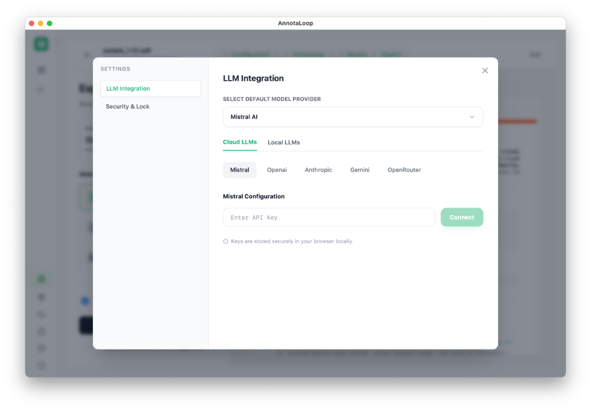
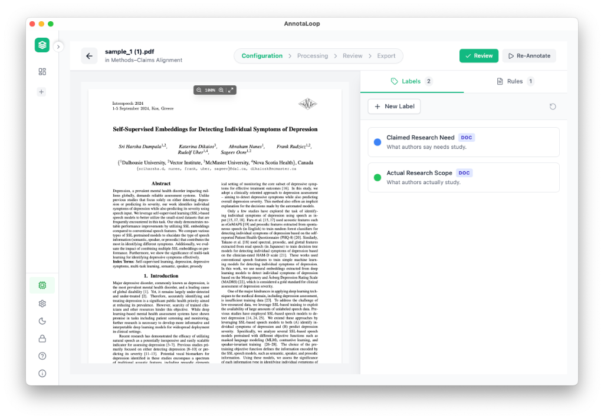

<div align="center">

# AnnotaLoop

**AI-Assisted Document Annotation with Human-in-the-Loop Workflows**

[](https://opensource.org/licenses/MIT)
[](https://github.com/tayyab-nlp/AnnotaLoop/releases/latest)
[](https://github.com/tayyab-nlp/AnnotaLoop/releases)

[Website](https://tayyab.io/annotaloop) • [Download](#download) • [Features](#features) • [Videos](#video-tutorials) • [Support](https://github.com/tayyab-nlp/AnnotaLoop/issues)

</div>

---

## Download

Get the latest version of AnnotaLoop for your platform:

| Platform | Download Link | Architecture |
|----------|--------------|--------------|
| **macOS (Apple Silicon)** | [⬇️ Download DMG](https://github.com/tayyab-nlp/AnnotaLoop/releases/latest/download/anotaloopv2_aarch64.dmg) | ARM64 |
| **macOS (Intel)** | [⬇️ Download DMG](https://github.com/tayyab-nlp/AnnotaLoop/releases/latest/download/anotaloopv2_x64.dmg) | x64 |
| **Windows** | [⬇️ Download Installer](https://github.com/tayyab-nlp/AnnotaLoop/releases/latest/download/anotaloopv2_x64-setup.exe) | x64 |
| **Linux (AppImage)** | [⬇️ Download AppImage](https://github.com/tayyab-nlp/AnnotaLoop/releases/latest/download/anotaloopv2_amd64.AppImage) | x86_64 |
| **Linux (Debian)** | [⬇️ Download .deb](https://github.com/tayyab-nlp/AnnotaLoop/releases/latest/download/anotaloopv2_amd64.deb) | x86_64 |

> **Note:** For all available versions, visit the [Releases page](https://github.com/tayyab-nlp/AnnotaLoop/releases).

### macOS Installation

1. Download the appropriate DMG for your Mac (Apple Silicon or Intel)
2. Open the DMG file
3. Drag AnnotaLoop to your Applications folder
4. **First launch:** Right-click the app and select "Open" (due to macOS Gatekeeper)
5. You may need to allow the app in System Settings > Privacy & Security

---

## What is AnnotaLoop?

AnnotaLoop is a powerful desktop application that streamlines document annotation workflows using AI assistance. It combines state-of-the-art Large Language Models with human oversight to create high-quality, structured data from documents.

<div align="center">



*Document → AI Suggests → Human Reviews → Structured Output*

</div>

### Perfect For

- **Researchers** extracting structured data from academic papers
- **Legal professionals** analyzing contracts and legal documents
- **Data scientists** creating training datasets
- **Content analysts** categorizing and tagging documents
- **Anyone** who needs to extract structured information from text documents

---

## How It Works

<div align="center">


</div>

1. **Import** your documents (PDF, DOCX, TXT, Markdown)
2. **Configure** labels and extraction rules for your use case
3. **Process** with AI - the LLM suggests annotations based on your rules
4. **Review** all suggestions in an intuitive interface
5. **Export** accepted annotations in your preferred format

---

## Features

### Core Capabilities

- **AI-Powered Annotation** - Leverage cloud LLM providers (Mistral AI, OpenAI, Claude, Gemini, OpenRouter)
- **Multi-Format Support** - Process PDFs, Word documents, text files, and Markdown
- **Custom Labels & Rules** - Define your own annotation schema with extraction rules
- **Human-in-the-Loop** - Review, accept, reject, or modify AI suggestions
- **Batch Processing** - Annotate multiple documents efficiently
- **Flexible Export** - Export to JSON, CSV, or annotated PDFs
- **Project Management** - Organize documents into projects with reusable configurations
- **Security** - Optional PIN-based app lock for sensitive data
- **Dark Mode** - Beautiful light and dark themes

---

## Video Tutorials

Get started quickly with these comprehensive video guides:

| Tutorial | Description |
|----------|-------------|
| [Start Your First Project](https://tayyab.io/annotaloop/#video-complete-workflow) | Complete walkthrough from setup to export |
| [LLM Setup Guide](https://tayyab.io/annotaloop/#video-llm-setup) | Configure your AI provider |
| [Batch Processing](https://tayyab.io/annotaloop/#video-batch-processing) | Process multiple documents at once |
| [Import & Export](https://tayyab.io/annotaloop/#video-import-export) | Manage your annotation projects |

---

## Screenshots

<div align="center">

### Welcome Screen

*Get started with your first project or import existing work*

---

### LLM Integration

*Connect to your preferred AI provider with secure API key storage*

---

### Project Configuration

*Define custom labels for document annotation*

---

### Configuration Modal

*Set up extraction rules for intelligent data extraction*

---

### Project Dashboard

*Manage and track all your documents in one place*

---

### Review Annotations

*Review AI-suggested annotations with confidence scores*

---

### Export & Analysis

*Export your annotated data in multiple formats*

</div>

---

## Tech Stack

- **Frontend**: React + TypeScript + Tailwind CSS
- **Backend**: Tauri (Rust)
- **PDF Processing**: pdf-lib, pdfjs-dist
- **Document Conversion**: mammoth.js (DOCX)
- **State Management**: React Context
- **Icons**: Lucide React

---

## Development

### Prerequisites

- **Node.js** (LTS version)
- **Rust** (stable toolchain)
- **Platform-specific dependencies**:
  - macOS: Xcode Command Line Tools
  - Linux: `libwebkit2gtk-4.1-dev`, `libgtk-3-dev`, `librsvg2-dev`, `patchelf`, `libxdo-dev`
  - Windows: WebView2 (usually pre-installed)

### Setup

```bash
# Clone the repository
git clone https://github.com/tayyab-nlp/AnnotaLoop.git
cd AnnotaLoop

# Install dependencies
npm install

# Run in development mode
npm run tauri dev

# Build for production
npm run tauri build
```

### Project Structure

```
AnnotaLoop/
├── src/                    # React frontend
│   ├── components/         # UI components
│   │   ├── annotation/     # Annotation workflow
│   │   ├── dashboard/      # Project dashboard
│   │   ├── modals/         # Modal dialogs
│   │   └── ui/             # Reusable UI components
│   ├── services/           # Business logic & API clients
│   ├── utils/              # Helper functions
│   └── context/            # React Context
├── src-tauri/              # Tauri backend (Rust)
│   ├── src/                # Rust source code
│   ├── icons/              # App icons
│   ├── capabilities/       # Tauri permissions
│   └── tauri.conf.json     # Tauri configuration
├── .github/workflows/      # CI/CD automation
└── docs/                   # Documentation & screenshots
```

---

## Auto-Updates

AnnotaLoop includes automatic update functionality:

- Checks for updates on every launch
- Notifies users when a new version is available
- One-click download and installation
- Seamless update process with automatic restart

---

## License

AnnotaLoop is open-source software licensed under the [MIT License](https://opensource.org/licenses/MIT).

**Free & Open Source Forever** - Use it, modify it, share it!

---

## Contributing

Contributions are welcome! Here's how you can help:

1. Report bugs via [Issues](https://github.com/tayyab-nlp/AnnotaLoop/issues)
2. Suggest features by opening a discussion
3. Submit pull requests for bug fixes or features
4. Improve documentation
5. ⭐ Star the repository to show your support!

---

## Support

Need help or found a bug?

- Check the [video tutorials](#video-tutorials)
- Open an [issue](https://github.com/tayyab-nlp/AnnotaLoop/issues)
- Contact: [hello@tayyab.io](mailto:hello@tayyab.io)
- Visit: [tayyab.io/annotaloop](https://tayyab.io/annotaloop)

---

## Acknowledgments

Built with modern open-source technologies and powered by state-of-the-art LLMs from:
- Mistral AI
- OpenAI
- Anthropic
- Google (Gemini)
- OpenRouter

---

<div align="center">

Made with ❤️ by [Tayyab](https://tayyab.io)

[⭐ Star on GitHub](https://github.com/tayyab-nlp/AnnotaLoop) • [Visit Website](https://tayyab.io/annotaloop) • [⬇️ Download](https://github.com/tayyab-nlp/AnnotaLoop/releases/latest)

</div>
