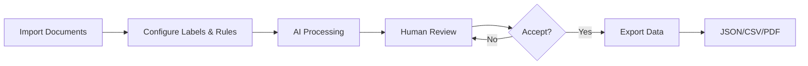

<div align="center">

# AnnotaLoop

**AI-Assisted Document Annotation with Human-in-the-Loop Workflows**

[](https://opensource.org/licenses/MIT)
[](https://github.com/tayyab-nlp/AnnotaLoop/releases/latest)
[](https://github.com/tayyab-nlp/AnnotaLoop/releases)

[Website](https://tayyab.io/annotaloop) • [Download](#-download) • [Documentation](#-features) • [Videos](#-video-tutorials) • [Support](https://github.com/tayyab-nlp/AnnotaLoop/issues)

</div>

---

## 📥 Download

Get the latest version of AnnotaLoop for your platform:

| Platform | Download Link | Architecture |
|----------|--------------|--------------|
| **🍎 macOS (Apple Silicon)** | [Download DMG](https://github.com/tayyab-nlp/AnnotaLoop/releases/latest/download/anotaloopv2_0.1.4_aarch64.dmg) | ARM64 |
| **🍎 macOS (Intel)** | [Download DMG](https://github.com/tayyab-nlp/AnnotaLoop/releases/latest/download/anotaloopv2_0.1.4_x64.dmg) | x64 |
| **🪟 Windows** | [Download Installer](https://github.com/tayyab-nlp/AnnotaLoop/releases/latest/download/anotaloopv2_0.1.4_x64-setup.exe) | x64 |
| **🐧 Linux (AppImage)** | [Download AppImage](https://github.com/tayyab-nlp/AnnotaLoop/releases/latest/download/anotaloopv2_0.1.4_amd64.AppImage) | x86_64 |
| **🐧 Linux (Debian)** | [Download .deb](https://github.com/tayyab-nlp/AnnotaLoop/releases/latest/download/anotaloopv2_0.1.4_amd64.deb) | x86_64 |

> **💡 Note:** For the latest version, visit the [Releases page](https://github.com/tayyab-nlp/AnnotaLoop/releases/latest).

### macOS Installation

1. Download the appropriate DMG for your Mac (Apple Silicon or Intel)
2. Open the DMG file
3. Drag AnnotaLoop to your Applications folder
4. **First launch:** Right-click the app and select "Open" (due to macOS Gatekeeper)
5. You may need to allow the app in System Settings > Privacy & Security

---

## ✨ What is AnnotaLoop?

AnnotaLoop is a powerful desktop application that streamlines document annotation workflows using AI assistance. It combines state-of-the-art Large Language Models with human oversight to create high-quality, structured data from documents.

### 🎯 Perfect For

- **Researchers** extracting structured data from academic papers
- **Legal professionals** analyzing contracts and legal documents
- **Data scientists** creating training datasets
- **Content analysts** categorizing and tagging documents
- **Anyone** who needs to extract structured information from text documents

---

## 🚀 Features

### Core Capabilities

- 🤖 **AI-Powered Annotation** - Leverage cloud LLM providers (Mistral AI, OpenAI, Claude, Gemini, OpenRouter)
- 📄 **Multi-Format Support** - Process PDFs, Word documents, text files, and Markdown
- 🏷️ **Custom Labels & Rules** - Define your own annotation schema with extraction rules
- ✅ **Human-in-the-Loop** - Review, accept, reject, or modify AI suggestions
- 📦 **Batch Processing** - Annotate multiple documents efficiently
- 💾 **Flexible Export** - Export to JSON, CSV, or annotated PDFs
- 🔄 **Project Management** - Organize documents into projects with reusable configurations
- 🔐 **Security** - Optional PIN-based app lock for sensitive data
- 🌓 **Dark Mode** - Beautiful light and dark themes

### Workflow



1. **Import** your documents (PDF, DOCX, TXT, Markdown)
2. **Configure** labels and extraction rules for your use case
3. **Process** with AI - the LLM suggests annotations based on your rules
4. **Review** all suggestions in an intuitive interface
5. **Export** accepted annotations in your preferred format

---

## 📺 Video Tutorials

Get started quickly with these comprehensive video guides:

| Tutorial | Description |
|----------|-------------|
| [🎬 Start Your First Project](https://tayyab.io/annotaloop/#video-complete-workflow) | Complete walkthrough from setup to export |
| [⚙️ LLM Setup Guide](https://tayyab.io/annotaloop/#video-llm-setup) | Configure your AI provider |
| [📦 Batch Processing](https://tayyab.io/annotaloop/#video-batch-processing) | Process multiple documents at once |
| [📤 Import & Export](https://tayyab.io/annotaloop/#video-import-export) | Manage your annotation projects |

---

##  Screenshots

<div align="center">

### Dashboard


### Annotation Workflow


### Review Panel


### Export Options


</div>

---

## 🛠️ Tech Stack

- **Frontend**: React + TypeScript + Tailwind CSS
- **Backend**: Tauri (Rust)
- **PDF Processing**: pdf-lib, pdfjs-dist
- **Document Conversion**: mammoth.js (DOCX)
- **State Management**: React Context
- **Icons**: Lucide React

---

## 👩‍💻 Development

### Prerequisites

- **Node.js** (LTS version)
- **Rust** (stable toolchain)
- **Platform-specific dependencies**:
  - macOS: Xcode Command Line Tools
  - Linux: `libwebkit2gtk-4.1-dev`, `libgtk-3-dev`, `librsvg2-dev`, `patchelf`, `libxdo-dev`
  - Windows: WebView2 (usually pre-installed)

### Setup

```bash
# Clone the repository
git clone https://github.com/tayyab-nlp/AnnotaLoop.git
cd AnnotaLoop

# Install dependencies
npm install

# Run in development mode
npm run tauri dev

# Build for production
npm run tauri build
```

### Project Structure

```
AnnotaLoop/
├── src/                    # React frontend
│   ├── components/         # UI components
│   │   ├── annotation/     # Annotation workflow
│   │   ├── dashboard/      # Project dashboard
│   │   ├── modals/         # Modal dialogs
│   │   └── ui/             # Reusable UI components
│   ├── services/           # Business logic & API clients
│   ├── utils/              # Helper functions
│   └── context/            # React Context
├── src-tauri/              # Tauri backend (Rust)
│   ├── src/                # Rust source code
│   ├── icons/              # App icons
│   ├── capabilities/       # Tauri permissions
│   └── tauri.conf.json     # Tauri configuration
├── .github/workflows/      # CI/CD automation
└── public/                 # Static assets
```

---

## 🔄 Auto-Updates

AnnotaLoop includes automatic update functionality:

- Checks for updates on every launch
- Notifies users when a new version is available
- One-click download and installation
- Seamless update process with automatic restart

---

## 🚀 Creating a Release

Follow these steps to publish a new version:

### 1. Update Version

Edit `src-tauri/tauri.conf.json`:

```json
{
  "version": "0.2.0"  // Increment version
}
```

### 2. Commit and Tag

```bash
git add .
git commit -m "Release v0.2.0: Description of changes"
git push origin main

# Create and push tag (MUST start with 'app-v')
git tag app-v0.2.0
git push origin app-v0.2.0
```

### 3. GitHub Actions

The tag push triggers the release workflow which:
- Builds for macOS (Apple Silicon & Intel), Windows, and Linux
- Signs the binaries for auto-updates
- Creates a draft release with all installers
- Generates `latest.json` for the update checker

### 4. Publish

1. Go to [Releases](https://github.com/tayyab-nlp/AnnotaLoop/releases)
2. Edit the draft release
3. Add release notes
4. Click **Publish release**

---

## 📜 License

AnnotaLoop is open-source software licensed under the [MIT License](https://opensource.org/licenses/MIT).

**Free & Open Source Forever** - Use it, modify it, share it!

---

## 🤝 Contributing

Contributions are welcome! Here's how you can help:

1. 🐛 **Report bugs** via [Issues](https://github.com/tayyab-nlp/AnnotaLoop/issues)
2. 💡 **Suggest features** by opening a discussion
3. 🔧 **Submit pull requests** for bug fixes or features
4. 📖 **Improve documentation**
5. ⭐ **Star the repository** to show your support!

---

## 🆘 Support

Need help or found a bug?

- 📖 Check the [video tutorials](#-video-tutorials)
- 💬 Open an [issue](https://github.com/tayyab-nlp/AnnotaLoop/issues)
- 📧 Contact: [hello@tayyab.io](mailto:hello@tayyab.io)
- 🌐 Visit: [tayyab.io/annotaloop](https://tayyab.io/annotaloop)

---

## 🙏 Acknowledgments

Built with modern open-source technologies and powered by state-of-the-art LLMs from:
- Mistral AI
- OpenAI
- Anthropic
- Google (Gemini)
- OpenRouter

---

<div align="center">

Made with ❤️ by [Tayyab](https://tayyab.io)

[⭐ Star on GitHub](https://github.com/tayyab-nlp/AnnotaLoop) • [🌐 Visit Website](https://tayyab.io/annotaloop) • [📥 Download](https://github.com/tayyab-nlp/AnnotaLoop/releases/latest)

</div>
